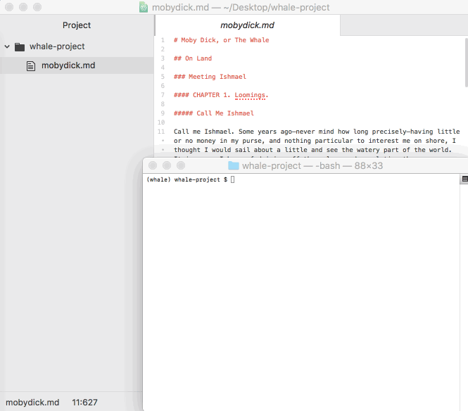

.. image:: https://codecov.io/gh/edelgm6/draft/branch/master/graph/badge.svg?token=Qh4Eni15kt
    :target: https://codecov.io/gh/edelgm6/draft
.. image:: https://travis-ci.com/edelgm6/draft.svg?branch=master
    :target: https://travis-ci.com/edelgm6/draft
.. image:: https://readthedocs.org/projects/draft-cli/badge/?version=latest
    :target: https://draft-cli.readthedocs.io/en/latest/?badge=latest
    :alt: Documentation Status
.. image:: https://img.shields.io/pypi/pyversions/draft-cli.svg
    :target: https://pypi.org/project/draft-cli/
    :alt: PyPI - Python Version

Draft: Write Like a Programmer
==============================
Draft is a CLI-enabled *writing system* to keep your work modular, optimize your project for git for version control, and just make writing more *fun*.

.. inclusion-marker-do-not-remove-above

.. inclusion-marker-do-not-remove-below

Primary Features
----------------
When you're writing something short, a Google Doc or Word file works great.
But get beyond a few thousand words and you end up in scroll-hell (i.e., the 'thumb' of the scrollbar is tiny and just navigating the doc is a chore).

Draft turns that half-finished novel into a clean, plaintext file tree perfect for git.

- ``parse`` any Markdown file into a file tree of Sections, Chapters, Sub-chapters, and Scenes
- ``sequence`` your files and directories to maintain a sequential index
- ``outline`` your project to help plan and fill in gaps
- ``compile`` your Scenes, Sub-Chapters, Chapters, and Sections into a single document once you're ready to publish
- Other features include ``stats`` (word count, etc.), ``trim`` (remove duplicate spaces), and ``split`` (put each sentence on its own line)

Installation
------------

``pip install draft-cli``

Documentation
-------------

https://draft-cli.readthedocs.io/en/latest/
